**Phrack에서 유출된 Linux 스텔스 루트킷 분석**

2025년 8월 14일 SandFly 팀

[Phrack Magazine](https://www.phrack.org/) 제72호는 최근 북한 혹은 중국 해킹 그룹으로 추정되는 단체로부터 유출된 데이터 덤프를 공개했습니다. 이 데이터에는 대규모 익스플로잇 기술, 침해된 시스템 정보, 그리고 Linux를 표적으로 삼은 스텔스 루트킷이 포함되어 있습니다. 우리는 해당 루트킷을 분석했으며, 사고 대응 담당자를 위해 추가 탐지 및 운영 세부 정보를 제공합니다.

팀들은 초기 Phrack 기사를 반드시 읽어보시기를 강력히 권장합니다. 해당 기사에서는 다음과 같은 내용을 강조합니다:

1. 중국계 위협 행위자가 한국과 대만의 정부 및 민간 부문을 표적으로 삼았습니다. 일부 표적과 전술은 북한 김수키 APT 그룹과 일치합니다.
2. 데이터 덤프는 공격자들이 한국 정부 내부 네트워크에 접근했으며 민감한 인증서에 접근할 수 있었음을 시사합니다.
3. 공격자의 데스크톱 스크린샷에는 백도어 개발이 진행 중임을 보여줍니다.

Phrack은 아래에 전체 데이터 덤프와 유출된 정보의 PDF 기사를 제공했습니다. 이 아카이브에는 다중 플랫폼용 활성 악성 소프트웨어 바이너리가 포함되어 있으므로 주의해서 다루시기 바랍니다:

[Phrack 북한 데이터 덤프](https://drive.proton.me/urls/ZQ1235FY7C#P0khjXI2uEtS)

**루트킷 세부 정보**

Phrack 기사에 따르면, 이 악성 소프트웨어는 탐지를 회피하고 모든 네트워크 포트에서 작동할 수 있는 로드 가능한 커널 모듈(LKM) 스타일의 루트킷입니다. 데이터 덤프에는 루트킷의 두 개의 번들이 포함되어 있습니다. 이 분석은 가장 최근에 날짜가 표시된 2025 버전입니다.

루트킷은 다음과 같은 기능을 가지고 있습니다:

* 악성 코드가 Linux 커널 시스템 호출을 가로채고 차단하여 탐지를 회피하는 데 널리 사용되는 [khook 라이브러리](https://github.com/milabs/khook)를 기반으로 합니다.
* lsmod와 같은 도구로 커널 모듈이 목록에 표시되지 않도록 숨깁니다.
* 프로세스와 백도어 네트워크 활동을 숨깁니다.
* */etc/init.d* 및 */etc/rc\*.d* 디렉토리에 생성된 지속성 파일을 숨깁니다.
* 어떤 포트에서든 매직 패킷을 수신하여 백도어를 활성화합니다.
* 백도어는 쉘 실행, 파일 업로드/다운로드, 프록시 활성화, 또는 측면 이동을 위해 호스트를 연결하는 기능을 수행할 수 있습니다.
* 백도어 바이너리와 생성된 쉘에 대한 포렌식 방지 기능이 포함되어 있습니다.
* 모든 트래픽은 암호화됩니다.

**루트킷 탐지**

이 루트킷은 고객 업데이트 없이 Sandfly에서 기본적으로 탐지 가능합니다. 우리는 이 유형의 루트킷에 대한 탐지 기록을 이미 보유하고 있습니다. 우리는 고객들이 이 루트킷을 정확하고 대규모로 탐지하기 위해 자동화된 도구를 사용하도록 **강력히 권장**합니다. 그러나 이 기사에서 설명하는 침해 조사 대상 호스트에 적용할 수 있는 수동 명령어를 제공할 것입니다. 아래는 이 커널 루트킷과 백도어가 활성화된 호스트에서 Sandfly가 생성하는 기본 알림입니다.

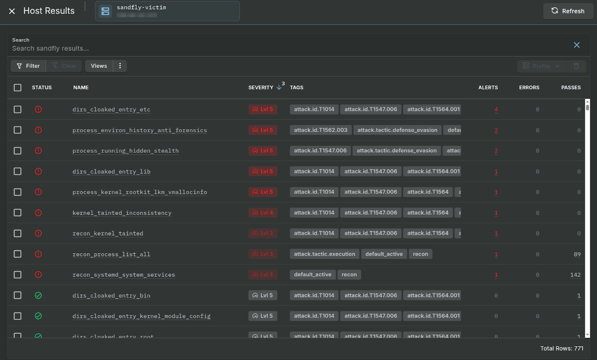

**루트킷 기본 동작**

대부분의 LKM 스타일 루트킷과 마찬가지로 이 루트킷도 취약하고 특정 커널 버전에 따라 동작합니다. 이 루트킷도 예외는 아닙니다. 성공적으로 배포하려면 공격자는 특정 피해자 커널 버전용으로 빌드된 버전을 보유해야 합니다. 이는 번거롭고 위험하지만, 한 번 작동하면 모듈이 활성화되어 조용히 작동합니다. 그러나 이는 시스템 업데이트가 새로운 커널을 포함할 경우 루트킷이 완전히 실패하거나 로드되지 않거나 정상적으로 작동하지 않을 수 있음을 의미합니다.

**커널 모듈 위치**

악성 모듈은 공개된 버전에서 ***/usr/lib64/tracker-fs***에 저장됩니다. 이는 공격자가 쉽게 변경할 수 있으므로 특정 탐지에 의존해서는 안 됩니다. 그러나 초기 사고 대응 시 다음 명령어를 사용하여 모듈을 검색하는 것은 나쁘지 않은 방법입니다:

**stat /usr/lib64/tracker-fs**

**file /usr/lib64/tracker-fs**

이 명령어는 어떤 파일도 표시하지 않아야 합니다. 데이터가 반환된다면 모듈이 존재하며, 이는 호스트에서 활성화되었거나 과거에 활성화되었음을 의미합니다. 모듈이 활성화되었을 때 볼 수 있는 몇 가지 예시는 다음과 같습니다.

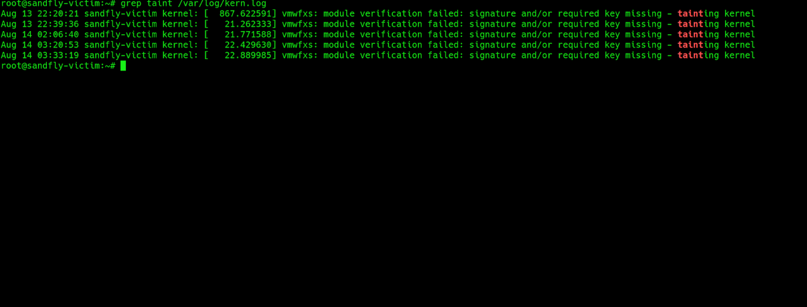

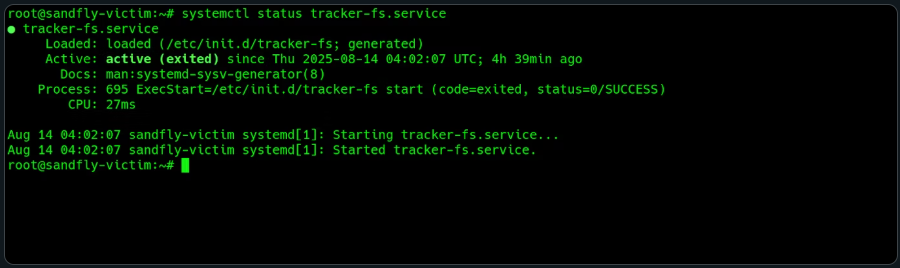

**서명되지 않은 모듈 커널 오염(Taint) 지표**

다음 문제의 징후는 커널 모듈이 서명되지 않았다는 것입니다. Linux에서 서명되지 않은 커널 모듈은 합법적인 공급업체(예: 그래픽 카드)에 의해 사용될 수 있지만, 시스템이 서명되지 않은 모듈을 사용하지 않는 경우 문제가 될 수 있습니다. 이 게시물에서 [오염된 커널 모듈 탐지](https://sandflysecurity.com/blog/sandfly-4-3-2-linux-loadable-kernel-module-rootkit-taint-detection)를 다루지만, 기본 명령어로도 확인할 수 있습니다.

이 루트킷의 기본 악성 커널 모듈 이름은 ***vmwfxs***입니다. 공격자가 이 이름을 쉽게 변경할 수 있으므로 이 문자열을 직접 검색하는 것은 권장하지 않습니다. 대신 다음 명령어를 사용하여 시스템에서 사용 중인 오염된 모듈을 확인하면 새로운 변종을 노출할 수 있습니다.

이 세 가지 명령어는 오염 상태 또는 이 루트킷에서 사용되는 이름인 ***vmwfxs*** 모듈의 의도적인 로딩을 표시합니다.

**dmesg | grep taint**

**dmesg | grep vmwfxs**

**grep taint /var/log/kern.log**

영향을 받은 시스템에서 ***dmesg*** 명령어로 오염 상태를 검색할 때 출력은 아래와 유사할 것입니다. 출력을 평가하여 모듈 이름이 의심스럽거나 예상치 못한 지 확인하세요.

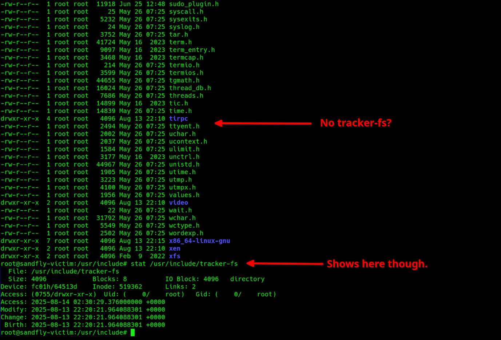

***dmesg***는 링 버퍼이므로 시간이 지나면서 메시지가 롤아웃될 수 있습니다. 일부 시스템에서 더 지속적인 정보를 확인할 수 있는 다른 영역은 ***/var/log/kern.log***입니다. 아래는 시스템 재부팅 시 각 부팅 시 커널 모듈이 로드될 때마다 다중 오염 메시지가 표시되는 예시입니다. ***dmesg*** 명령어는 디스크에 저장된 ***/var/log/kern.log***와 달리 이러한 연속성을 표시하지 않습니다.

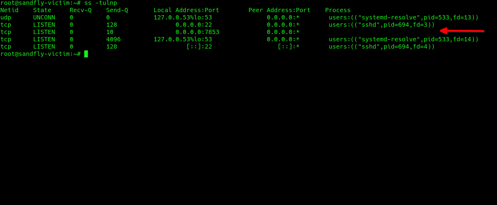

Sandfly에서는 오염된 커널을 식별하지만, 한 단계 더 나아가 커널 오염이 있지만 원인을 일으킨 모듈이 목록에 없는 경우도 확인합니다. 이는 모듈이 로드된 후 목록에서 자신을 제거하여 숨기려는 시도일 수 있습니다. 불행히도 이 검사는 매우 유용하지만, 이를 광범위하게 실행할 수 있는 직접적인 커맨더 도구가 없기 때문에 사용 가능한 경우 우리 탐지 기능을 사용하는 것을 권장합니다.

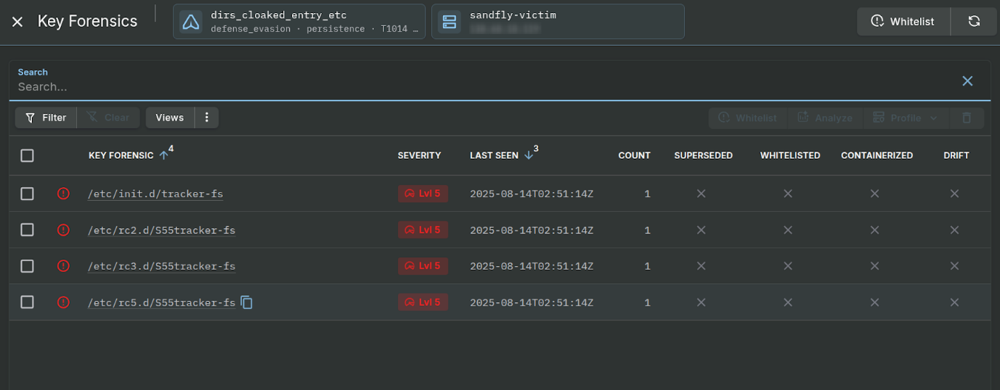

또한 드리프트 감지를 사용하는 고객의 경우 오염 상태가 예상 프로필에서 변경된 경우 경고합니다. 이 기능도 사용 가능한 경우 훌륭한 옵션입니다.

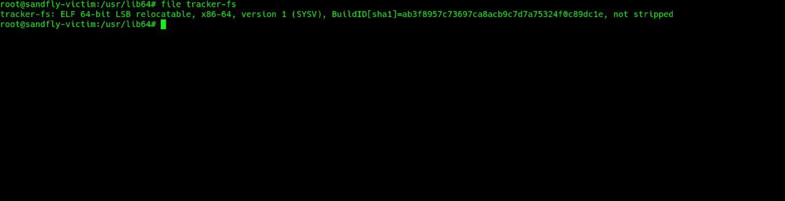

**숨겨진 파일 및 디렉토리**

루트킷이 설치되면 커널 모듈, 백도어 프로그램, 부팅 시 로드되도록 하는 지속 메커니즘을 숨기기 위해 파일을 생성합니다. 해당 파일은 다음과 같습니다:

**/usr/lib64/tracker-fs (모듈)**

**/usr/include/tracker-fs/tracker-efs (백도어)**

**/etc/init.d/tracker-fs**

**/etc/rc2.d/S55tracker-fs**

**/etc/rc3.d/S55tracker-fs**

**/etc/rc5.d/S55tracker-fs**

**숨겨진 악성 모듈**

악성 커널 모듈은 ***/usr/lib64/tracker-fs*** 디렉토리에 위치합니다. 이 파일은 모듈이 활성화된 상태에서는 볼 수 없지만, 아래와 같이 직접 참조하면 일반 시스템 유틸리티로 읽을 수 있습니다:

**stat /usr/lib64/tracker-fs**

**file /usr/lib64/tracker-fs**

위 두 명령어는 커널 모듈이 존재할 경우 파일 정보를 표시합니다. 표준 ***ls*** 명령어로 디렉토리 목록에서 볼 수 없더라도 말이죠.

이 예시에서 우리는 ***/usr/lib64*** 디렉토리에 대해 ***ls***를 실행했지만 모듈을 볼 수 없습니다. 하지만 파일 이름을 직접 지정하여 ***stat*** 및 ***file*** 명령어를 실행하면 실제로 존재하지만 단순히 보이지 않는다는 것을 확인할 수 있습니다.

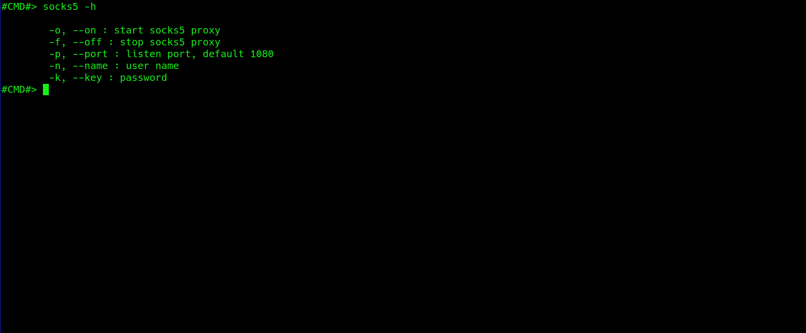

**숨겨진 백도어 바이너리**

커널 모듈과 마찬가지로 백도어가 활성화될 때 실행되는 숨겨진 바이너리가 있습니다. 이 바이너리는 ***/usr/include/tracker-fs/tracker-efs***에 숨겨져 있습니다. 아래는 ***/usr/include*** 디렉토리에서 ***ls*** 명령어를 실행한 결과로, 숨겨진 ***tracker-fs*** 디렉토리가 표시되지 않습니다. 그러나 이 디렉토리로 이동하여 ***ls*** 명령어를 실행하면 백도어 바이너리가 아래와 같이 표시됩니다:

**cd /usr/include/tracker-fs**

**ls -al**

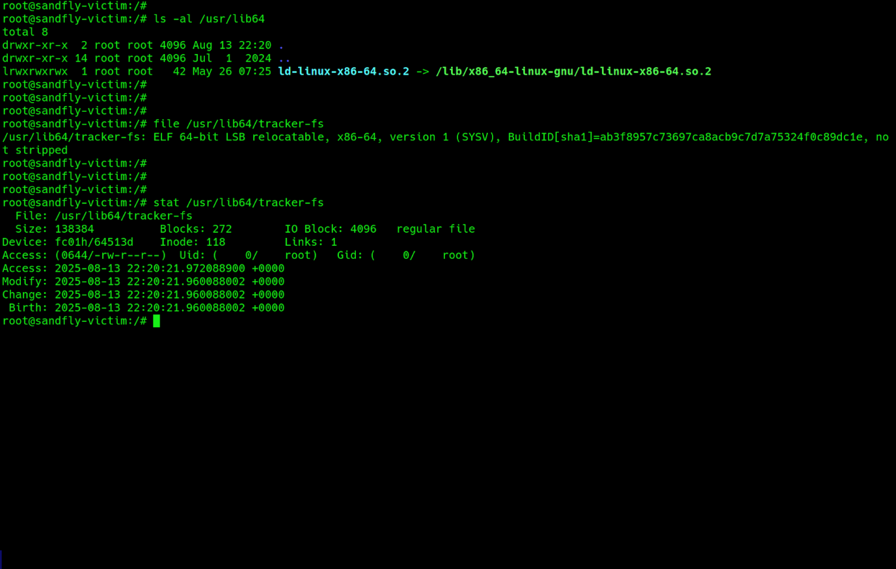

**지속성(Persistence) 메커니즘**

백도어는 호스트에 여러 개의 중복된 지속성 메커니즘을 생성합니다. 이 변종에서 해당 파일은 다음 위치에 위치하며, 루트킷이 활성화되면 숨겨집니다:

**/etc/init.d/tracker-fs**

**/etc/rc2.d/S55tracker-fs**

**/etc/rc3.d/S55tracker-fs**

**/etc/rc5.d/S55tracker-fs**

이 파일들은 부팅 시 악성 커널 모듈을 삽입하는 간단한 스크립트를 포함합니다:

**#!/bin/bash**

***#***

**case “$1” in**

**‘start’)**

**/sbin/insmod /usr/lib64//tracker-fs**

**;;**

**‘stop’)**

**;;**

**esac**

**exit 0**

보안 팀은 단순히 *cat* 또는 파일 목록을 확인하여 데이터를 확인할 수 있습니다. 루트킷은 ***ls*** 명령어로 파일을 숨기지만, 다음과 같이 읽는 것을 방지하지 않습니다:

**cat /etc/init.d/tracker-fs**

**cat /etc/rc2.d/S55tracker-fs**

**cat /etc/rc3.d/S55tracker-fs**

**cat /etc/rc5.d/S55tracker-fs**

위 방법은 현재 버전에서 작동하지만, 파일 이름이 변경되면 작동하지 않습니다. 관리자가 파일 목록 명령어로 파일을 볼 수 없기 때문에, 이름이 변경되면 다른 방법으로 숨김을 해제하지 않는 한 해당 파일이 무엇인지 파악하기 어려워집니다.

**Systemd 지속성**

위 스크립트는 아래와 같이 ***systemd*** 서비스를 목록으로 표시하여 확인할 수 있습니다.

**systemctl status tracker-fs.service**

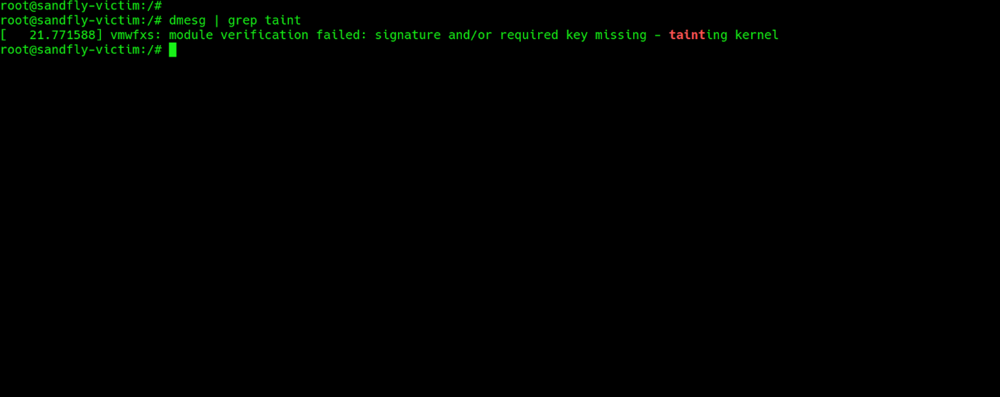

Sandfly를 실행 중인 경우 Host -> Services 뷰에서 새로운 ***systemd*** 서비스를 확인할 수 있습니다. 아래에서 ***tracker-fs.service***를 볼 수 있습니다. 빨간색 아이콘은 이 호스트에서 예상치 않게 드리프트 감지 표시가 되었음을 의미합니다.

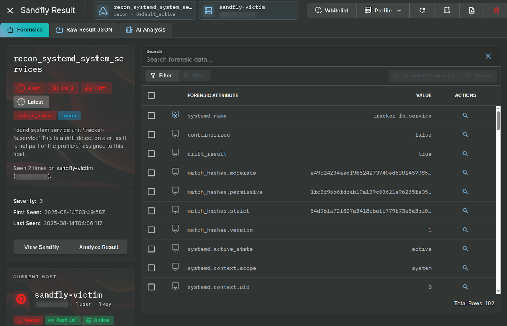

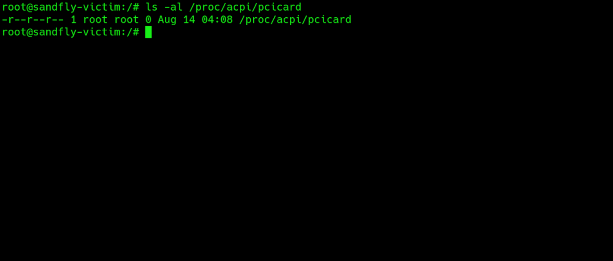

**숨겨진 파일 탐지 자동화**

위와 같이 수동으로 파일 숨김 해제를 수행하는 것이 번거롭고 오류가 발생하기 쉽다고 생각하신다면, 그 판단은 맞습니다. 우리는 고객들이 Sandfly를 사용하여 이 작업을 자동화할 것을 강력히 권장합니다. Sandfly는 이 루트킷 및 기타 루트킷에 의해 숨겨진 파일을 즉시 숨김 해제하여 이러한 문제를 매우 쉽게 찾을 수 있도록 합니다. Sandfly의 탐지는 파일 이름을 어떻게 변경하더라도 작동합니다. 아래에서는 모든 숨겨진 파일이 완전히 숨김 해제된 상태로 표시됩니다. 우리는 에이전트 없이, 빠르게, 안전하게 이 작업을 수행하도록 설계되었습니다.

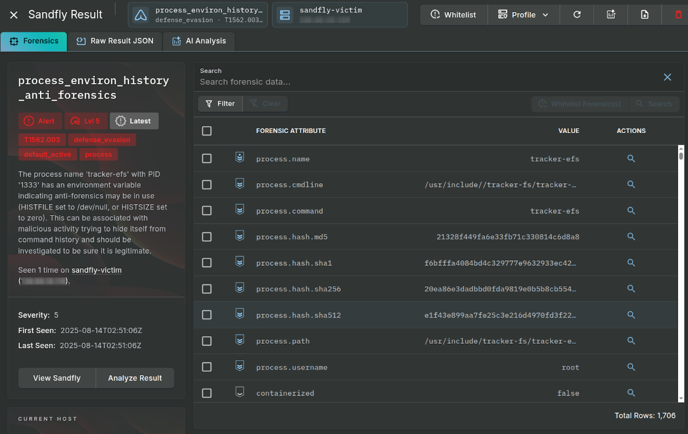

**백도어 바이너리 문자열 분석**

백도어 바이너리에 대한 간단한 ***strings*** 명령어는 상황을 확인하는 악성 데이터를 표시합니다. 아래에서는 이 파일에서 포렌식 방지 문자열 등 매우 의심스러운 콘텐츠를 확인할 수 있습니다.

**strings /usr/include/tracker-fs/tracker-efs**

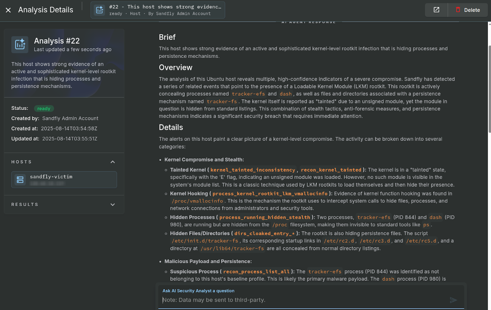

**통신 소켓**

커널 모듈과 백도어는 ***/proc*** 디렉토리에 위치한 소켓을 통해 통신합니다. 현재 버전에서는 ***/proc/acpi/pcicard***에 위치하며 다음 명령어로 확인할 수 있습니다:

**ls -al /proc/acpi/pcicard**

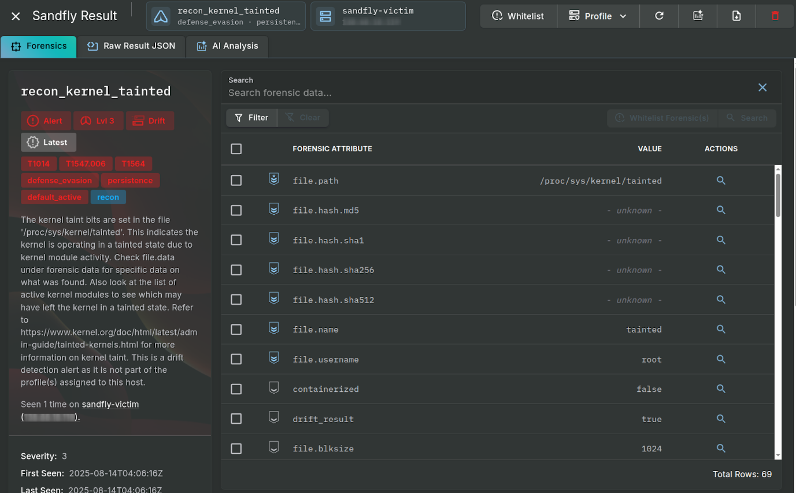

Phrack 기사에서는 이 소켓을 통해 통신하는 백도어의 작동 방식을 상세히 설명합니다. 우리 분석에서는 시스템에 백도어를 초기화하는 단계를 넘어서는 자세히 조사하지 않았으며, 이는 곧 논의할 내용입니다.

**백도어 동작**

루트킷의 주요 목적은 지속적이고 은밀한 백도어를 생성하는 것입니다. 백도어는 특수 매직 패킷과 올바른 비밀번호가 결합되어 SSL 연결을 초기화할 때 활성화됩니다. 백도어는 **어떤 포트에서도** 활성화될 수 있습니다. 이는 방화벽만으로는 대상 시스템을 보호하지 못할 수 있다는 점을 이해하는 것이 중요합니다. 매직 패킷이 피해 시스템에 도달하면 백도어가 활성화될 수 있습니다. 활성 포트에서 실행될 수 있기 때문에 백도어 트래픽은 웹 서버나 SSH와 같은 암호화 서비스와 혼합될 수 있습니다. 또는 완전히 사용되지 않는 포트로 전송되어 다른 방어 메커니즘을 회피할 수도 있습니다.

**백도어 비밀번호**

백도어는 작동하기 위해 비밀번호가 필요합니다. 공개된 변종에서는 단일 값으로 설정되어 있지만, 이는 쉽게 변경될 수 있으며 팀은 이를 단독으로 검색하는 것에 의존할 수 없습니다. 그러나 비밀번호는 무단 사용자의 활성화 방지 역할을 합니다.

**백도어 기능**

백도어 자체는 아래 도움말 메뉴에서 확인할 수 있듯이 기본적이면서도 강력한 기능을 갖추고 있습니다:

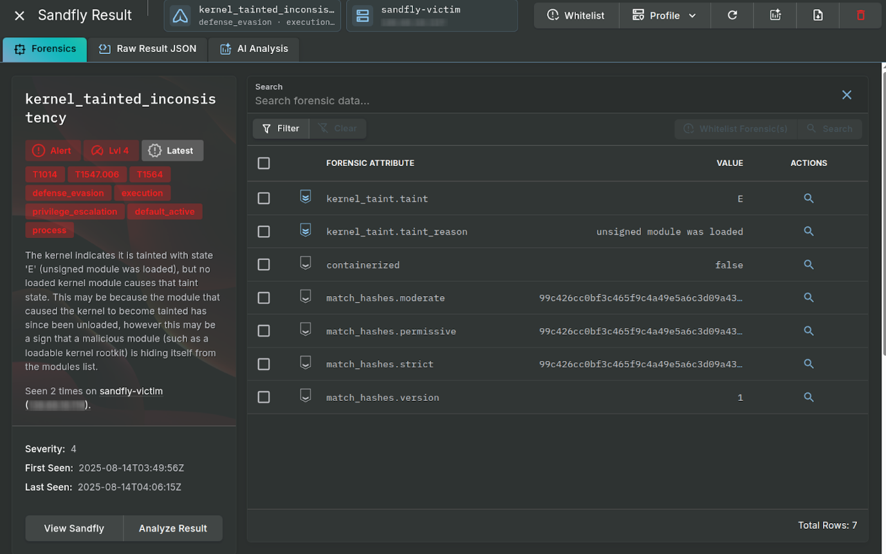

기본 명령어는 다음과 같습니다:

* 대상 시스템에서 쉘을 시작합니다.
* 파일 업로드/다운로드.
* 백도어를 통해 다른 시스템으로 이동하여 측면 이동 수행.
* SOCKS5 프록시 열기.
* 연결 정보 표시.

**숨겨진 백도어 프로세스**

백도어 바이너리는 ***/usr/include/tracker-fs/tracker-efs***에 위치합니다. 활성화되면 숨겨진 프로세스로 실행되며 ***ps***와 같은 시스템 명령어로 확인할 수 없습니다. 또한 ***ss***와 같은 도구에서 네트워크 포트 활동을 숨깁니다. 아래는 모든 활성 포트 프로세스를 목록으로 표시하는 ***ss*** 명령어의 출력 결과입니다. 항목 중 하나는 프로세스 데이터가 완전히 누락되어 있으며, 이는 활성 백도어입니다.

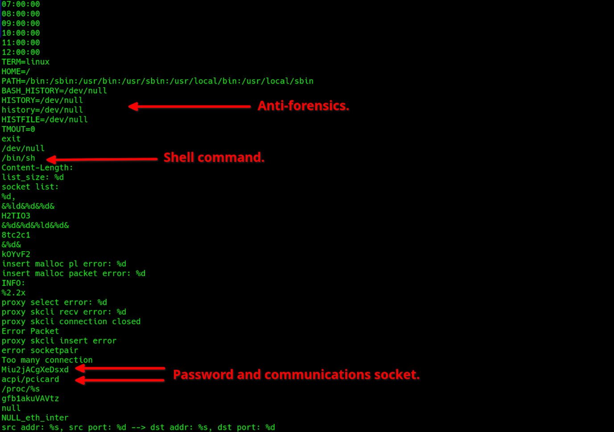

시스템 명령어로 프로세스가 숨겨져 있지만, Sandfly는 실제로 이를 완전히 노출(de-cloak)시킵니다.

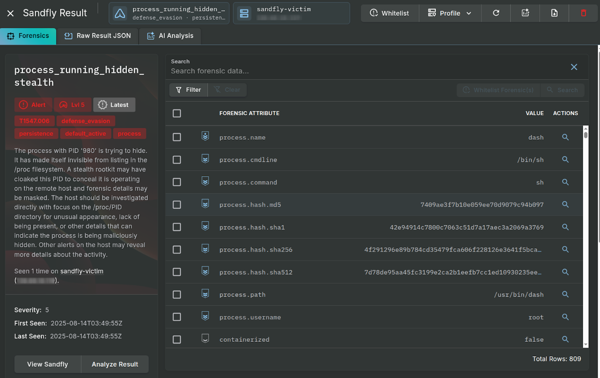

**백도어 포렌식 방지**

쉘은 명령어 기록과 시간 초과를 방지하기 위해 기본적인 포렌식 방지 기능을 활성화합니다. 이를 위해 다양한 사용이력 환경 변수를 ***/dev/null****로 설정합니다.* 또한 쉘 시간 초과를 0으로 설정하려고 시도합니다. 불행히도 프로세스가 숨겨져 있어 검사하기 어렵습니다. 그러나 무료 [sandfly-processdecloak](https://github.com/sandflysecurity/sandfly-processdecloak) 도구를 사용하여 숨겨진 프로세스를 노출시킬 수 있습니다:

[sandfly-processdecloak GitHub 리포지토리](https://github.com/sandflysecurity/sandfly-processdecloak)

숨겨진(cloaked) PID를 얻으면 다음 명령어로 프로세스 환경을 확인할 수 있습니다:

**strings /proc/PID/environ**

숨겨진 프로세스(PID 2533)의 출력은 아래와 같이 이력 파일을 ***/dev/null***로 설정하는 의심스러운 환경 변수 설정을 보여줍니다.

아래는 Sandfly가 보고한 활성 백도어의 포렌식 방지 기능입니다. 백도어 프로세스에 의해 생성된 쉘은 포렌식 방지 기능을 상속받습니다.

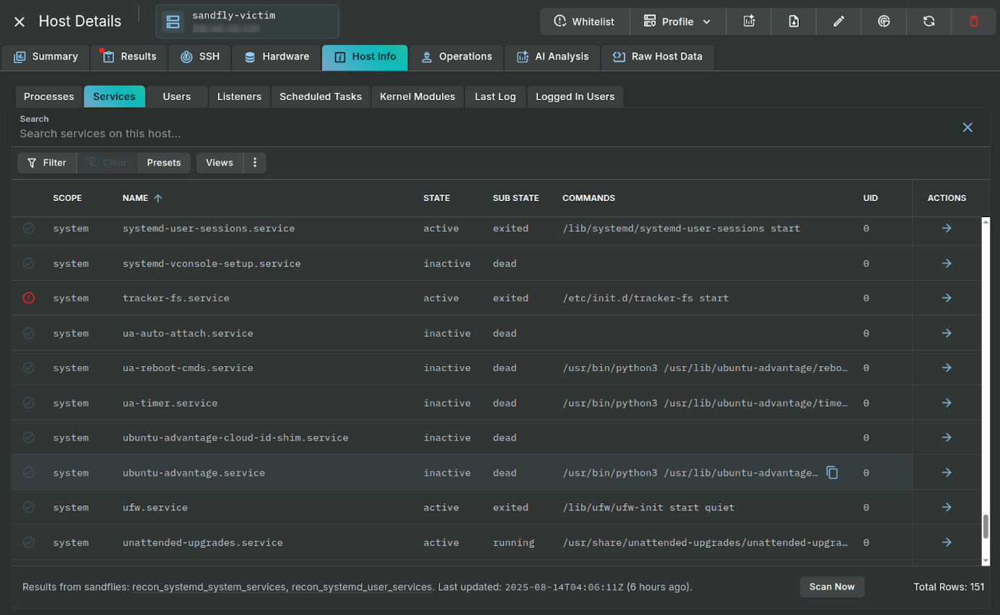

**백도어 멀티-Hop, SOCKS5 프록시 및 파일 유틸리티**

백도어는 운영자가 여러 루트킷을 연결하여 시스템 간 이동할 수 있도록 합니다. 또한 파일 업로드/다운로드 및 SOCKS5 프록시 시작 기능도 포함됩니다.

아래는 ***trans***명령어의 도움말입니다. 공격자가 시스템 간 이동을 위해 사용할 수 있는 흥미로운 매개변수가 여러 개 있습니다. 포트 노크 및 프로토콜 유형 변경 등이 포함됩니다. 이 메커니즘을 통해 공격자는 감염된 호스트에 흔적을 남기지 않고 스텔스 루트킷을 사용하여 시스템 간 이동이 가능합니다.

마찬가지로, SOCKS5 옵션에도 공격자가 활용할 수 있는 명령어가 있습니다:

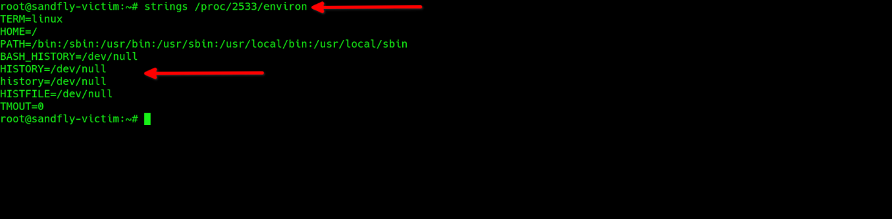

**백도어 쉘**

호스트에서 쉘을 실행하여 영향을 받은 시스템을 직접 공격할 수 있는 옵션도 있습니다.

쉘에는 패킷 스트림을 지연시키는 흥미로운 **“-t”** 옵션이 있습니다. 이는 상태 기반 네트워크 모니터링 규칙을 회피하거나 다중 Hop 연결에서의 타임아웃을 방지하기 위한 목적일 수 있습니다.

쉘이 실행되면 백도어 부모 프로세스의 일부로 숨겨집니다. 이를 다시 노출하려면 Sandfly와 같은 특수 도구나 위에서 언급된 무료 프로세스 노출 도구가 필요합니다.

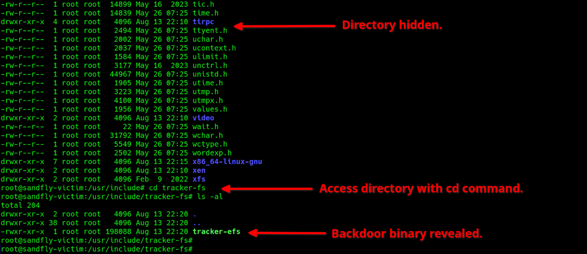

**Sandfly의 AI 분석 활용**

위 내용은 많은 정보를 포함하고 있지만, 최근 Sandfly 5.5에 AI LLM 통합을 도입했습니다. 에이전트 없는 Linux 포렌식 데이터는 우수하며, 이는 주요 LLM 제공업체 및 온프레미스 솔루션에서 매우 우수한 분석 결과를 제공합니다. 아래는 루트킷 경고에 대한 AI 분석 결과로, 발생 중인 상황을 정확히 요약한 내용입니다. 고객들은 이 기능을 사용하여 경고 분류(triage)에 도움을 받으시기를 권장합니다.

**감염된 시스템 정리**

이 질문을 자주 받기 때문에 명확히 밝히겠습니다: **루트킷에 영향을 받은 Linux 호스트를 정리하려고 시도하지 마십시오.** 시스템은 격리되어야 하며, 공격자가 시스템에 침입한 방법을 파악하기 위해 원인 분석을 수행한 후 파괴되어야 합니다. 루트 권한이 획득되면 시스템에 어떤 변경이 가해졌는지 확인할 수 없으며, 재구축해야 합니다.

**최종 결론**

이 문서가 광고처럼 보이지 않도록 노력했지만, 이처럼 은밀한 루트킷은 자동화된 탐지 작업이 필수적이며, 영향을 받은 시스템이 식별된 후에만 수동 검토가 필요합니다. 이 루트킷은 비교적 잘 알려진 기반 라이브러리(***khook***)를 사용합니다. 그러나 다중 호스트를 통해 사이런트로 작동하며 측면 이동을 가능하게 하는 강력한 백도어를 추가했습니다. Phrack 기사에서는 이 루트킷이 국가 차원의 도구 키트 일부라고 주장하며, 우리 분석과 다른 유출된 데이터에 따르면 이는 가능성이 높습니다.

고객 여러분은 모든 Linux 시스템에 주의를 기울여 주시기 바랍니다. 우리는 에이전트 없는 Linux 보안 솔루션을 사용하기 위한 무료 체험판과 사고 대응 라이선스를 제공합니다.

**감사의 말씀**

Phrack의 저자들에게 데이터 덤프와 초기 분석에 대해 감사드립니다. 자세한 내용은 그들의 웹사이트를 방문해 주시기 바랍니다:

[Phrack](https://sandflysecurity.com/blog/www.phrack.org)

위협 행위자의 하드 드라이브 원본 덤프와 Phrack의 분석 내용은 아래에 포함되어 있습니다:

[Phrack North Korean Data Dump](https://drive.proton.me/urls/ZQ1235FY7C#P0khjXI2uEtS)

**침해 지표**

아래에 침해 지표 목록을 포함합니다. 주의사항: 이 값들은 루트킷 작성자에 의해 쉽게 변경될 수 있으며, 짧은 시간 내에 오래된 정보가 될 수 있습니다. Linux에서 파일 이름이나 다른 취약한 지표를 검색하는 대신 일반적인 공격 전술을 추적하는 것을 권장합니다. 또한 Linux 악성 소프트웨어를 찾기 위해 해시 값을 사용하지 않도록 권장합니다. 해시 값은 매우 신뢰할 수 없습니다.

**/usr/lib64/tracker-fs**

**/usr/include/tracker-fs/tracker-efs**

**/etc/init.d/tracker-fs**

**/etc/rc2.d/S55tracker-fs**

**/etc/rc3.d/S55tracker-fs**

**/etc/rc5.d/S55tracker-fs**

**/proc/acpi/pcicard**
